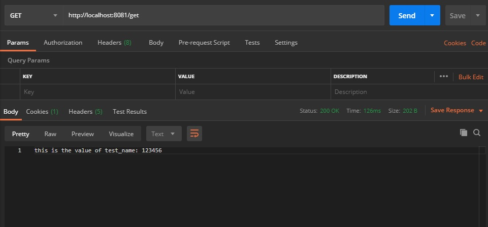

# spring cloud config sample
This project is an attempt to demonstrate the usage of spring cloud config for centralizing external configurations. 

---

## Overview
This project contains 3 sub projects:

1. serviceregisty - plays as the eureka server
2. config-server - serves the configurations
2. config-client - fetches configurations from the config-server internally

---

## Features
1. config-client and config-server are integrated with **eureka server** (no need to set the address of config server manually).
2. a **relational storage** is utilized in config-server (here h2 database is used ).
3. configurations are encrypted in a **symmetric way**.
4. api exposed by config-server are secured by **basic authentication**.

---

## Modules
### serviceregistry
This modules is the eureka server with the minimum configuration. It listens on port 8761 and its address is hardcoded in config-server and config-client

### config-server
config-server uses spring-cloud-config for centralizing configuration. It uses H2 database for storing configuration.
Also apis exposed by this module, which are used by config-client for fetching configurations, are secured using basic authentication.

There are 2 built-in apis  which worth elaborating:
1. /encrypt : this api is used for encrypting data using the provided key for the config-server.
2. /decrypt : as the name suggests encrypted values can get decrypted using this api.

### config-client
This is a typical spring boot project which fetches its configurations from the config-server. This module contains a custom api which returns the value
of a configuration which is expected to be fetched during startup.
By sending a GET request to /get api the value of the configuration will be returned as response. 
   
---   

## Setup

### Requirements

1. git
2. at least oracle jdk8

### Steps

1. `git clone https://github.com/ali4j/cloud-condig-sample.git`

2. `mavenw clean install -DskipTests`

    after successful build, first run eureka server
    
3. `cd serviceregistry\target`
  
4. `java -jar serviceregistry-0.0.1-SNAPSHOT.jar`

    then start the config-server
    
5. `cd ..\..\SpringBootCloudConfig\target`

6. `java -jar SpringBootCloudConfig-0.0.1-SNAPSHOT.jar`

    finally start the config-client
    
5. `cd ..\..\springbootcloudconfigclient\target`

6. `java -jar springbootcloudconfigclient-0.0.1-SNAPSHOT.jar`    
 
### Test

    Notes:
        **key** is used as the key value for encryption process.
        **test** and **test** are used as username and password of basic authentication for config-server exposed apis.
        
    
#### config-server
After suuceesfully running config server, it is possible to test the api exposed by it. Based on the provided security config
**/encrypt** and **/decrypt** apis are available anonymously.
    
    
    
As the image shows the encrypted value of **123456** is **0ee121580e05834c79ab972d9f542c03c8cfb752fbf08d027a4f0d441ab8ce05**.

The image below should how to get the stored configurations from config server:

#### config-client
config-client is expected to fetch configurations at startup. By calling **/get** api from config-client a key-value which is fetch from 
config-server is injected in to the controller and its value is returned as the response of get request.

 
